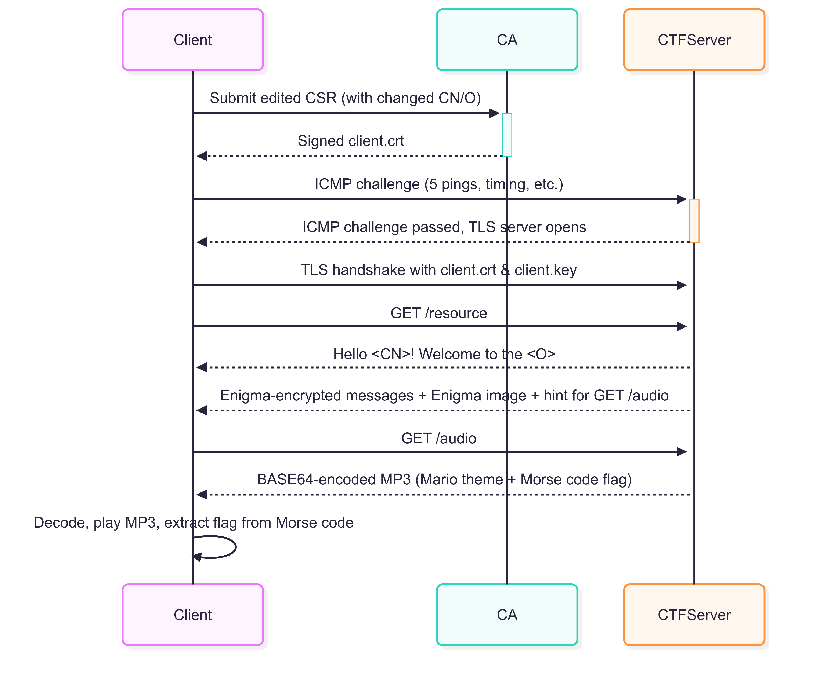

# CTF Networks Challenge: Operation BLACKBIRD INTERCEPT


> **Academic Course**: Advanced Computer Networks (Spring 2024)  
> **Institution**: Lev Academic Center  
> **Lecturer**: Barak Gonen  
> **Network Topics**: 8+ Advanced Topics

## 🎯 Mission Overview

### Background Story
Following an operational incident on the northern border, an advanced Iranian drone with unique characteristics fell into the hands of Israeli intelligence. During an in-depth examination of its electronic components, a small, concealed module was discovered - identified as a malicious server with communication and data storage capabilities.

**The Discovery**: The Israeli Intelligence cyber team encountered a disturbing finding – an Iranian-made drone that fell in Israeli territory, within which a sophisticated malicious server was discovered. Initial investigation raises suspicion that the server is not merely a potential attack tool, but serves a highly covert espionage system, unwittingly exploiting Israeli citizens as intelligence sources.

**Your Mission**: As part of the elite cyber team, you are tasked with analyzing the server's operational methods, exposing the hidden spy network, and leveraging this knowledge for national security. You must complete three progressive network challenges (ICMP covert channels, Certificate Authority infiltration, and Enigma cryptographic analysis) to extract the final intelligence from the mario.mp3 file.

## Table of Contents

- [🚀 Quick Start](#-quick-start)
- [📖 Detailed Challenge Walkthroughs](#-detailed-challenge-walkthroughs)
- [📋 Prerequisites & Required Knowledge](#-prerequisites--required-knowledge)
- [🔧 Required Analysis Tools](#-required-analysis-tools)
- [🛠️ Environment Setup & Deployment](#️-environment-setup--deployment)
- [🔍 Mission Phases](#-mission-phases)
  - [Phase 1: ICMP Covert Channel](#phase-1-icmp-covert-channel-️)
  - [Phase 2: Certificate Authority Infiltration](#phase-2-certificate-authority-infiltration-️)
  - [Phase 3: Enigma Cryptographic Analysis](#phase-3-enigma-cryptographic-analysis-️)
- [📁 Project File Structure](#-project-file-structure)
- [✅ Mission Success Criteria](#-mission-success-criteria)
- [🎓 Academic Assessment](#-academic-assessment)
- [🤝 Contributing](#-contributing)
- [📄 License](#-license)

---

---

## 🚀 Quick Start

```bash
# Secure the investigation environment
git clone <repository-url>
cd ctf-networks-challenges

# Install analysis toolkit
pip install -r requirements.txt
python verify_installation.py

# Start CTF GUI (provides full control over all servers)
python -m tls.gui

# The GUI will handle starting the ICMP challenge server (Phase 1).
# You must manually start the CA server for Phase 2 via the GUI when ready.
```

**🚨 PARTICIPANT AUTONOMY**: You have full control over when to start the CA server. The main CTF server handles ICMP challenges, but you must manually deploy the Certificate Authority when ready for Phase 2.

---

## 📖 Detailed Challenge Walkthroughs

For comprehensive step-by-step solutions with complete code implementations, troubleshooting guides, and detailed learning outcomes, please refer to the following detailed walkthrough documents:

### 🎯 Complete Solution Guides

| Challenge Phase      | Walkthrough Document                | Topics Covered                                              | Difficulty |
|----------------------|-------------------------------------|-------------------------------------------------------------|------------|
| Phase 1: ICMP        | [ICMP_CHALLENGE_WALKTHROUGH.md](documents/ICMP_CHALLENGE_WALKTHROUGH.md)   | Packet crafting, Scapy, timing constraints, protocol analysis | ⭐⭐⭐☆☆     |
| Phase 2: CA          | [CA_CHALLENGE_WALKTHROUGH.md](documents/CA_CHALLENGE_WALKTHROUGH.md)       | PKI infiltration, Burp Suite MITM, certificate manipulation, file recovery | ⭐⭐⭐⭐☆     |
| Phase 3: Enigma      | [ENIGMA_CHALLENGE_WALKTHROUGH.md](documents/ENIGMA_CHALLENGE_WALKTHROUGH.md) | Steganography, historical cryptography, audio forensics, metadata extraction | ⭐⭐⭐⭐⭐     |

### 🛠️ What You'll Find in Each Walkthrough

Each comprehensive walkthrough includes:

- **📚 Theory & Background**: Detailed explanation of the underlying network security concepts
- **🔧 Complete Implementation**: Full working code solutions with explanations
- **🎯 Step-by-Step Instructions**: Detailed commands and procedures to follow
- **🐛 Troubleshooting Guide**: Common issues and their solutions
- **📊 Learning Outcomes**: Key takeaways and skills developed
- **🔍 Advanced Techniques**: Professional tools and methodologies used in real-world scenarios

### 🚀 How to Use the Walkthroughs

1. **Start with the overview** in this README to understand the mission context
2. **Follow the Quick Start** section to set up your environment
3. **Use the detailed walkthroughs** when you need complete solutions or are stuck
4. **Reference the troubleshooting sections** for common issues
5. **Review learning outcomes** to understand the educational objectives

> **💡 Educational Approach**: These walkthroughs are designed to be comprehensive educational resources. They provide both the solution and the reasoning behind each step, making them valuable for learning advanced network security concepts.

---

## 📋 Prerequisites & Required Knowledge

**Recommended Skill Level**: Intermediate to Advanced  
Participants should have foundational knowledge in the following areas:

**Programming**: Python proficiency for malware analysis and scripting.

**Network Analysis**: Deep understanding of the TCP/IP stack, HTTP/HTTPS, TLS/SSL, and packet inspection.

**Cryptography**: Public Key Infrastructure (PKI), certificate chains, TLS handshakes, and certificate validation.

**Security Tools**: Experience with Wireshark, Scapy, and command-line operations. Reverse engineering basics are a plus.

**Forensics**: Network packet analysis and traffic pattern recognition.

**Time Allocation**: 6-10 hours (classified operation).

---

## 🔧 Required Analysis Tools

**Network Analysis:**
- Wireshark (packet capture analysis)
- Scapy (custom packet crafting)

**Malware & Crypto Analysis:**
- Python 3.8+ (for scripting)
- OpenSSL (certificate operations)
- Burp Suite Community Edition (for HTTP request interception)
- Hex Editor (e.g., HxD, ghex) for binary analysis
- Forensic Tools: Recuva and Procmon

**Development Environment:**
- Git (version control)
- Virtual environment (for isolation)
- Text editor/IDE (e.g., VS Code)

---

## 🛠️ Environment Setup & Deployment

### Security Measures:
- Execute malware samples in isolated VMs only
- Monitor all network connections
- Document all analysis steps
- Maintain chain of custody for evidence

### Installation:

**Clone the repository:**
```bash
git clone https://github.com/shay0129/ctf-networks-challenges.git
cd ctf-networks-challenges
```

**Install Python dependencies:**
```bash
pip install -r requirements.txt
```

**Verify Installation:**
```bash
python verify_installation.py
# This script checks all required tools and dependencies.
```

### 🔐 Certificate Management

**Important**: Certificate files (`.crt`, `.key`) are not included in this repository for security reasons. They will be automatically generated when you run the CTF challenges:

- `ca.crt` - Created when CA server starts
- `client.crt` - Generated after successful CSR submission  
- `client.key` - Created during certificate request process

**Certificate Location**: All certificate files are created in the same directory as the running executable/GUI.

**Before GitHub Upload**: Use the cleanup script to ensure no certificates are accidentally committed:
```bash
python cleanup_certificates.py
```

### Running the CTF:

**Option 1: GUI Interface (Recommended)**  
The GUI provides a centralized control panel for managing the challenge servers.
```bash
# Run with admin/sudo privileges for ICMP packet sniffing
python -m tls.gui
```

**Option 2: Command Line Interface**
```bash
# Start the main CTF server (ICMP + TLS challenges)
# Run with admin/sudo privileges
python -m tls.ctf_server

# In a separate terminal, start the CA server when ready for Phase 2
python -m tls.server_challenges.ca_challenge
```

### ⚠️ Important Notes:
- **Administrator Privileges**: ICMP packet crafting and sniffing require administrator/root privileges. Run your terminal as Administrator (Windows) or use sudo (Linux/macOS).
- **Firewall**: Ensure your firewall allows Python applications to accept incoming connections.
- **Antivirus**: Some antivirus software may flag the ICMP components as suspicious. You may need to create an exception.

---

## 🔍 Mission Phases

The mission is divided into three sequential phases. You must complete each one to proceed to the next.

### 🔗 Sequential Challenge Flow

The CTF architecture enforces a **mandatory sequential flow** to prevent bypassing phases:

```
INTENDED FLOW:
┌─────────────┐    ┌─────────────┐    ┌─────────────┐
│ ICMP        │───▶│ CA Server   │───▶│ TLS Server  │
│ Challenge   │    │ (Port 8443) │    │ (Port 8444) │
│ (bbHHh!)    │    │ Independent │    │ After ICMP  │
└─────────────┘    └─────────────┘    └─────────────┘
     Step 1           Step 2           Step 3
```

**🔒 Security Architecture:**
- **Step 1**: ICMP challenge must be completed first (`bbHhh!` hint disappears)
- **Step 2**: CA server runs independently - participants manually start when ready
- **Step 3**: TLS server (port 8444) **only starts after** ICMP completion
- **🚨 Bypass Protection**: Certificates alone cannot skip ICMP - TLS server remains inaccessible until Step 1 is complete

### 🛡️ Enhanced Security Model

**Persistent State Tracking**: The CTF server now implements robust bypass prevention through persistent ICMP completion state tracking:

```
SECURITY ENHANCEMENTS:
┌─────────────────┐    ┌─────────────────┐    ┌─────────────────┐
│ ICMP Challenge  │───▶│ State Persisted │───▶│ TLS Available   │
│ Completion      │    │ (JSON File)     │    │ Across Restarts │
└─────────────────┘    └─────────────────┘    └─────────────────┘
```

**Key Security Features:**
- **🔄 Persistent State**: ICMP completion status saved to `ctf_icmp_state.json`
- **🚫 Restart-Proof**: Server restarts cannot bypass completed ICMP challenges
- **🔍 Continuous Checking**: `while` loop ensures ICMP completion before TLS access
- **✅ Legitimate Flow**: Previously completed challenges remain accessible
- **🔧 Debug Support**: `_reset_icmp_state()` method for testing scenarios

**Attack Prevention:**
- **Server Restart Bypass**: ❌ State persists across restarts
- **Direct TLS Connection**: ❌ TLS server only starts after ICMP completion
- **Certificate-Only Access**: ❌ Valid certificates alone cannot bypass ICMP requirement

### Phase 1: ICMP Covert Channel (⭐⭐⭐☆☆)

**Objective**: Complete the ICMP covert channel challenge by reverse-engineering and implementing precise packet timing and payload progression.

#### Participant Guidance

**Initial Contact**: When you first run `dronespy.exe` (or start the CTF server), you will see the cryptic message: `bbHhh!`. This is your primary clue for the structure of the ICMP header.

**Basic Exploration**: Start by pinging the server (`ping 127.0.0.1`). The server logs will show `DEBUG - ID 1 (expecting 4919)`. This tells you the server expects a custom ICMP ID: `4919` (hex: `0x1337`). Standard ping tools cannot set this, so you must craft your own packets.

**Packet Crafting**: The clue `bbHhh!` hints at Python's struct module format string for packing binary data (`!BBHHH`).
- **Low-Level (struct)**: This requires manual calculation of checksums and precise knowledge of the ICMP header format.
- **High-Level (Scapy)**: Scapy is the recommended tool. It handles low-level details like byte order and checksums automatically, allowing you to focus on the challenge logic. `ICMP(id=0x1337, seq=i)` is much simpler.

**Progressive Discovery**: Once you send a packet with the correct ID (`0x1337`), the server will provide feedback, revealing further requirements:
- **Packet Count**: Exactly 5 pings are required
- **Payload Size**: The payloads must progressively increase: 0, 100, 200, 300, and 400 bytes
- **Sequence Numbers**: The ICMP sequence numbers must be 1, 2, 3, 4, 5
- **Timing Constraint**: The entire sequence of 5 pings must be sent within a 9-11 second window

**Challenge Completion**: Success is indicated when the server logs "Challenge completed successfully" and the `bbHhh!` message no longer appears. The server will then be ready for Phase 2.

### Phase 2: Certificate Authority Infiltration (⭐⭐⭐⭐☆)

**Objective**: Penetrate the spy network's PKI by forging a client certificate to authenticate with the main server and intercept communications.

**🚨 PARTICIPANT CONTROL**: You must manually start the CA server for this phase via the GUI or command line.

#### Participant Guidance

**Analyze PCAP**: Examine the provided PCAP file in Wireshark. You will discover that the server requires clients to present a TLS certificate issued by a specific Certificate Authority (e.g., "IRGCA Root CA") with specific subject fields.

**Generate a CSR**: You need to create a Certificate Signing Request (CSR) that matches the required subject details found in the PCAP.

**Intercept and Modify (MITM)**: The provided `ca_client.py` generates a CSR with incorrect details. You must use a proxy like Burp Suite to intercept the HTTP request from the client to the CA server. Modify the CSR in the request to match the correct subject fields before forwarding it to the CA.

**Manual Certificate Handling**: After the CA signs the CSR and returns a certificate, you must manually copy and save it as `client.crt` in the same directory as `dronespy.exe`.

**Recover the Private Key**: After the CA signs the CSR and returns a certificate, the client script saves the corresponding private key (`client.key`) and then immediately deletes it. The logs will show "downloaded" and "deleted". You must use a file recovery tool (Recuva, photorec) to recover the deleted `client.key` file.

**Authenticate**: With the signed certificate (`.crt`) and the recovered private key (`.key`), you can now successfully authenticate to the main CTF server, which has been waiting for a valid client certificate since you completed Phase 1.

### Phase 3: Enigma Cryptographic Analysis (⭐⭐⭐⭐⭐)

**Objective**: Perform advanced steganographic and cryptographic analysis to decrypt the final layer of communication and extract the ultimate flag.

#### Participant Guidance

**Find the Hidden Data**: After a successful TLS handshake in Phase 2, the server creates an image file at `C:/Users/Public/Open-Me.png`. You must find this file. Tools like Procmon can help by monitoring the file system activity of the `dronespy.exe` process.

**Steganography**: Open `Open-Me.png` in a hex editor. Appended to the image data, you will find a hidden block of text containing the configuration for a historical Enigma machine (rotors, reflector, plugboard settings). You must extract this configuration.

**Enigma Decryption**: The server will now present you with several messages encrypted with the Enigma cipher. Using the configuration you extracted from the image, you must decrypt these messages. You can use an online Enigma simulator or write your own decryption script. The decrypted messages contain clues.

**Audio Analysis**: One of the clues will point towards base64 encoded data. The Enigma configuration block hidden in the image also contains a large chunk of base64 text. Decode this text to reveal an MP3 audio file.

**Final Flag Extraction**: The final flag is hidden within the metadata (ID3 tags) of the recovered `mario.mp3` audio file. Use a tool that can read MP3 metadata to find it.

---


## 📁 Project File Structure

```
Operation_BLACKBIRD/
├── tls/
│   ├── ctf_server.py              # Main CTF server
│   ├── server_challenges/
│   │   ├── icmp_challenge.py      # ICMP timing challenge logic
│   │   ├── ca_challenge.py        # Certificate authority challenge logic
│   │   ├── enigma_challenge.py    # Cryptographic challenge logic
│   │   └── ping_player.py         # ICMP reference implementation (for lecturers)
│   └── utils/                     # Support utilities
├── certificates/
│   ├── ca.crt                     # Certificate authority root
│   └── ...                        # Other certificate files
├── music/
│   └── mario.mp3                  # FINAL FLAG - Extract from ID3 metadata
├── requirements.txt
└── verify_installation.py
```

---

## ✅ Mission Success Criteria

**Mission Complete When:**

✅ **ICMP Stage**: Successfully complete timing challenge (5 pings in 9-11 seconds with progressive payload sizes).

✅ **CA Stage**: Submit valid CSR, obtain signed certificate, recover private key, and establish secure TLS handshake.

✅ **Enigma Stage**: Extract Enigma config, decrypt spy messages, recover audio file, and extract final flag.

✅ **Final Flag**: The final flag is extracted from the ID3 tags of mario.mp3.

---

## 🎓 Academic Assessment

### Network Security Topics Covered

This operation integrates **8+ advanced network security concepts:**

1. **Malware Analysis**: Static/dynamic analysis of drone C&C software
2. **Network Forensics**: PCAP analysis and traffic pattern recognition
3. **TLS/SSL Security**: Certificate validation and encrypted communication
4. **Socket Programming**: Low-level network communication analysis
5. **Certificate Authority**: PKI infrastructure and trust chains
6. **Packet Crafting**: Custom protocol communication with Scapy
7. **Python Network Development**: Automated analysis scripting
8. **Cryptographic Analysis**: Breaking encryption and cipher analysis

### Grading Criteria (Example)

- **ICMP Challenge (25%)**: Correct implementation of the packet crafter
- **CA Challenge (40%)**: Successful MITM of the CSR and recovery of the private key
- **Enigma Challenge (35%)**: Successful steganographic analysis and decryption
- **Final Report**: A detailed write-up of your methodology for each phase

---

## 🤝 Contributing

This CTF is designed for educational use.

- **Individual Work**: Please complete challenges independently
- **Documentation**: We welcome contributions that improve challenge descriptions or setup instructions
- **Bug Reports**: Please report any technical issues with the challenge infrastructure
- **Academic Integrity**: Adhere to your institution's academic integrity policies. Do not share flags or direct solutions

---

## 📄 License

This CTF challenge is released under the MIT License.

**Copyright (c) 2024 Lev Academic Center - Advanced Computer Networks Course**

Permission is hereby granted, free of charge, to any person obtaining a copy of this software and associated documentation files (the "Software"), to deal in the Software without restriction...

*(The full MIT License text follows)*

---

## 🚨 CLASSIFIED OPERATION COMPLETE 🚨

## Main CTF Flow and Audio Challenge

1. **Forensic & Certificate Phase**  
   - The participant must recover the deleted `client.key` file and generate a CSR.
   - The CSR must be edited (e.g., CN and O fields) before being signed by the CA server (`ca.crt`).
   - The CA signs the edited CSR, producing a valid `client.crt`.

2. **ICMP Challenge**  
   - The participant must pass the ICMP covert channel challenge to unlock the TLS server.

3. **TLS Handshake & HTTP Request**  
   - The participant connects to the CTF server using the signed `client.crt` and `client.key`.
   - The participant sends a `GET /resource` request, as seen in the provided PCAP file.

4. **Welcome & Enigma Challenge**  
   - The CTF server verifies the certificate fields and responds with a personalized hello message, inviting the participant to the “Iran college.”
   - The server sends a set of messages encrypted with an Enigma machine, and downloads an image of the Enigma machine to the participant’s PC.
   - The Enigma machine’s properties (rotor settings, etc.) are hidden in the hex view of the image.
   - The Enigma messages include a hint:  
     `Request the secret audio with GET /audio and inspect the response in your proxy tool.`

5. **Decryption & Audio Challenge**  
   - The participant decrypts the Enigma messages, which instruct them to request another message.
   - The server sends a BASE64-encoded byte stream of an MP3 file as a plain text HTTP response when the participant sends `GET /audio`.
   - The participant uses Burp Suite (or another HTTP proxy) to view and extract the BASE64 data, decodes it to an MP3 file, and plays it.
   - The MP3 contains the Mario theme, and at the end, a Morse code message embedded using Audacity reveals the CTF flag.

---

### Technical Implementation Notes

- The server only responds to `GET /audio` after the Enigma challenge is solved.
- The MP3 is sent as BASE64 in the HTTP response body, making it easy to extract with Burp Suite.
- The flag is embedded as Morse code at the end of the MP3 using Audacity.
- The Enigma image is sent as a file, with its settings hidden in the hex view.

---

### Example: Sending BASE64 MP3 in Server Code

```python
import base64

def send_audio(self, ssl_socket):
    with open('music/mario.mp3', 'rb') as f:
        b64_mp3 = base64.b64encode(f.read())
    response = b"HTTP/1.1 200 OK\r\nContent-Type: text/plain\r\n\r\n" + b64_mp3
    ssl_socket.sendall(response)
```

- Only call `send_audio` if the participant has solved the Enigma challenge.
- The participant can copy the BASE64 from Burp Suite, decode, and play the MP3 to get the flag.

---
