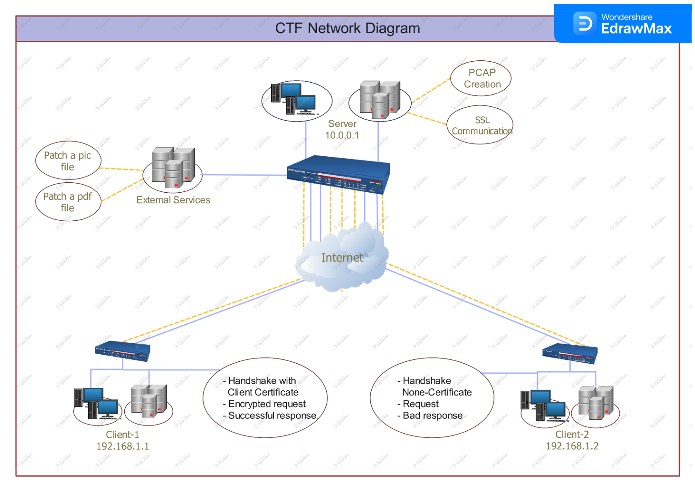

# CTF Challenge: TLS Handshake, Certificate Authority, and Encryption

## Project Overview
This project hosts a multi-stage Capture The Flag (CTF) challenge focused on network security, the TLS protocol, certificate management, and encrypted communication analysis. Participants are tested on their understanding of ICMP interactions, TLS handshake processes, client certificate validation with a Certificate Authority (CA), and analysis of encrypted messages.

This repository contains the server-side components and challenge logic for the CTF. The PCAP file used in some stages of this CTF (simulating TLS handshakes) is generated by a separate project: [Scapy TLS PCAP Creator](https://github.com/shay0129/scapy-tls-pcap-creator).

## Table of Contents
- [Challenge Theme](#challenge-theme)
- [Subjects Covered](#subjects-covered)
- [Project Components](#project-components)
  - [CTF Server Logic](#ctf-server-logic)
  - [PCAP File (Reference)](#pcap-file-reference)
- [Challenge Structure & Stages](#challenge-structure--stages)
  - [1. ICMP Timing Challenge](#1-icmp-timing-challenge)
  - [2. Certificate Authority (CA) Challenge](#2-certificate-authority-ca-challenge)
  - [3. Image & Enigma Encryption Challenge](#3-image--enigma-encryption-challenge)
- [Challenge Completion Requirements](#challenge-completion-requirements)
- [Participant's Solution Path (Overview)](#participants-solution-path-overview)
- [Technical Skills Developed](#technical-skills-developed)
- [External Tools Utilized by Participants](#external-tools-utilized-by-participants)
- [Setup & Running the CTF Server](#setup--running-the-ctf-server)
- [Contributing](#contributing)
- [License](#license)

---
## Challenge Theme
[This section is taken from your original README and seems good as is]

The challenge is themed around the Ritchie Boys, a historical group of German-born individuals recruited by the US Army in World War II for intelligence and psychological warfare against Nazi Germany. [cite: 1]
In the context of the challenge, the Ritchie Boys Force is revived in 2025 to combat Iran's Islamic Revolutionary Guard Corps. [cite: 1]
The player's goal is to compromise an Iranian server and extract the encryption key used for the organization's radio communications. [cite: 1]

 
*(Ensure this diagram and its path are relevant and present in this repository)*

---
## Subjects Covered 
[Adapted from your original README]

This CTF challenge helps develop a broad range of technical skills, including:
1.  **Network Protocol Analysis**: Using tools like Wireshark and Tshark to analyze network packets (e.g., ICMP, TLS). [cite: 1]
2.  **Cryptography**: Understanding key exchange, certificate signing (CSR/CA), decrypting messages, and classical ciphers (Enigma). [cite: 1]
3.  **Operating System Interaction/Forensics (Conceptual for CTF):** Analyzing server behavior (simulated), ID3 tags, Hex Editors. [cite: 1]
4.  **Problem Solving**: Applying diverse techniques to overcome sequential security challenges.
5.  **Tool Usage**: Utilizing tools like OpenSSL for certificate operations and Burp Suite for request manipulation (as part of the solution path). [cite: 1]

---
## Project Components

### CTF Server Logic
This repository contains the Python code for the CTF server which orchestrates the different challenge stages. The server listens for client interactions and presents challenges based on the participant's progress.

### PCAP File (Reference)
A pre-generated PCAP file is central to parts of this CTF, particularly the CA challenge. [cite: 1] This PCAP simulates TLS communication, including server requests for client certificates. [cite: 1]
* **Note:** The generation logic for this PCAP file resides in the [Scapy TLS PCAP Creator](https://github.com/shay0129/scapy-tls-pcap-creator) repository. This CTF assumes the availability of such a PCAP.

---
## Challenge Structure & Stages
[Combined and adapted from "Project Components" and "CTF Challenge Server Implementation" in your original README]

The CTF is comprised of three interconnected security challenges that participants must complete sequentially:

### 1. ICMP Timing Challenge
The initial stage involves precise ICMP packet interaction with the server. [cite: 1]
* Participants must send a specific number of ping requests (e.g., 5 requests). [cite: 1]
* Constraints include a timing window for the pings (e.g., 9-11 seconds). [cite: 1]
* Payload sizes for pings might need to progress in a specific manner (e.g., increasing by 100 bytes each time). [cite: 1]
* Successful completion of this stage (e.g., server prints "BBHHH!") triggers the next challenge. [cite: 1]

### 2. Certificate Authority (CA) Challenge
Upon completing the ICMP challenge, a CA server component activates to handle Certificate Signing Requests (CSRs). [cite: 1]
* Participants analyze the reference PCAP file to understand that the server requires a client certificate signed by a specific CA (e.g., "_IRGCA Root CA_"). [cite: 1]
* The challenge involves creating a CSR with specific subject details (e.g., Common Name, Organization), potentially by modifying a default CSR or creating a new one. [cite: 1]
    * Example required CSR Subject details:
        ```
        Common Name (CN): Shay
        Organizational Unit (OU): Cybersecurity Department
        Organization (O): Sharif University of Technology
        Locality (L): Tehran
        State or Province (ST): Tehran
        Country (C): IR 
        ```
        [cite: 1]
* Participants may need to use tools like Burp Suite to intercept and modify CSRs before they are signed by the CA, or use OpenSSL to create and sign CSRs if they have the CA's key and certificate. [cite: 1]
* The server validates the client certificate's Common Name and potentially other attributes like certificate length (simulating MITM detection). [cite: 1]

### 3. Image & Enigma Encryption Challenge
After a successful handshake in the CA stage, the server provides data leading to the final flag.
* The server may hide an Enigma encryption key within image data (steganography). [cite: 1]
* It then prints messages encrypted with an Enigma cipher, using a specific configuration (e.g., reflectors, rotor positions, plugboard settings). [cite: 1]
* The server might also send base64 encoded data representing an audio file (e.g., an MP3 file identifiable by "id3" tags) which contains the final flag. [cite: 1]

---
## Challenge Completion Requirements
[As per your original README]
1.  **ICMP Stage:** Successfully complete timing and payload challenges within request limits. [cite: 1]
2.  **CA Stage:** Submit a valid CSR, obtain a signed certificate, and establish a secure connection. [cite: 1]
3.  **Enigma Machine Stage:** Extract the encryption key, decrypt messages, and retrieve the final flag (e.g., from an audio file). [cite: 1]

---
## Participant's Solution Path (Overview)
[Adapted from "Participants Solution" in your original README]

Solving this CTF involves:
1.  **PCAP Analysis:** Using Wireshark/Tshark to understand TLS handshake details and certificate requirements from the provided PCAP. [cite: 1]
2.  **ICMP Interaction:** Crafting specific ICMP packets to satisfy the server's timing and payload criteria.
3.  **Certificate Management:** Creating/modifying CSRs, interacting with the (simulated) CA, and using the obtained client certificate to authenticate to the server. This may involve OpenSSL and Burp Suite. [cite: 1]
4.  **Steganography & Cryptography:** Analyzing provided data (e.g., image files) to find hidden keys, understanding Enigma cipher mechanics, and decrypting messages. [cite: 1]
5.  **Data Recovery:** Identifying and extracting the final flag from various data formats (e.g., audio files from base64 encoded data). [cite: 1]

---
## Technical Skills Developed
[Adapted from "Educational Value" in your original README]
* Practical understanding of Public Key Infrastructure (PKI) concepts and certificate management. [cite: 1]
* Application of classical cryptography (Enigma). [cite: 1]
* Network protocol analysis (ICMP, TLS). [cite: 1]
* Basic forensic techniques (data recovery, steganography). [cite: 1]
* Problem-solving across multiple integrated security domains. [cite: 1]

---
## External Tools Utilized by Participants
(Tools participants might need to solve the CTF)
* Wireshark / Tshark [cite: 1]
* OpenSSL [cite: 1]
* Burp Suite (or similar proxy) [cite: 1]
* Hex Editor [cite: 1]
* Enigma machine simulator/decoder
* Python with libraries like Scapy (for crafting packets, though the server is provided)

---
## Setup & Running the CTF Server

*(You need to provide instructions here. Based on your original README, it might be something like this, but please adapt it to how this specific CTF server is run):*

1.  **Clone the repository:**
    ```bash
    git clone [https://github.com/shay0129/ctf-networks-challenges.git](https://github.com/shay0129/ctf-networks-challenges.git)
    cd ctf-networks-challenges
    ```
2.  **Install dependencies:**
    *(Specify if there's a `requirements.txt` or other setup steps for the server)*
    ```bash
    # Example: pip install -r server_requirements.txt 
    ```
3.  **Run the CTF Server:**
    *(Specify the command to start your CTF server script)*
    ```bash
    # Example: python ctf_server.py
    ```
    *(Mention any configuration needed for the server, ports it listens on, etc.)*

---
## Contributing
Feel free to contribute to the project by opening issues or pull requests. [cite: 1]

---
## License
This project is licensed under the MIT License - see the [LICENSE](LICENSE) file for details. [cite: 1]
